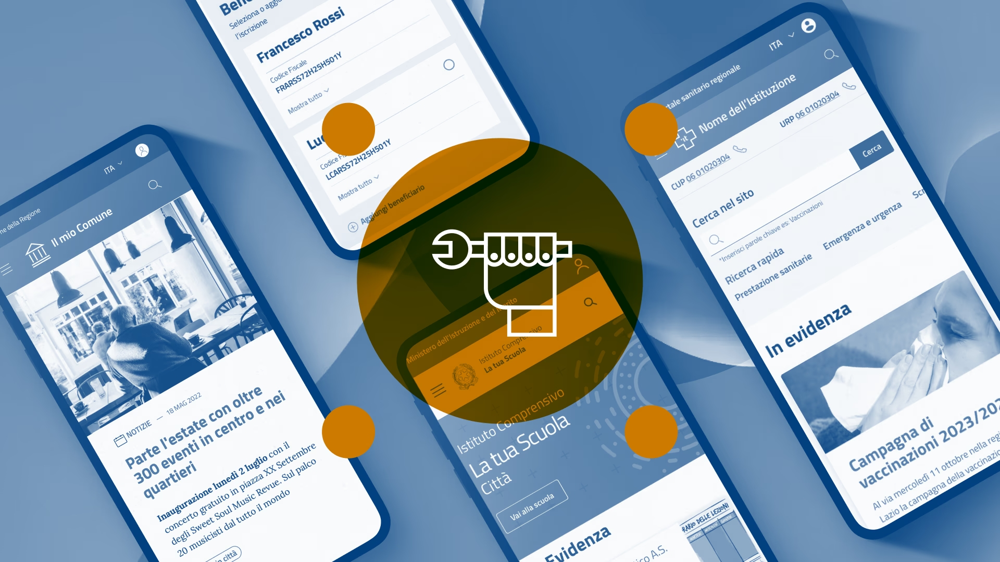

Progettare con i modelli di sito e servizi
==============================================

I modelli di sito e servizi realizzati da Designers Italia offrono una soluzione efficace per creare siti web di enti pubblici. Aderenti alle linee guida nazionali e alle migliori pratiche di progettazione digitale, questi modelli forniscono **indicazioni** e **risorse pronte all'uso** che consentono di impostare e svolgere il lavoro in modo rapido ed economico.

Vantaggi dell'utilizzo dei modelli 
--------------------------------------
L'adozione dei modelli comporta i seguenti benefici principali: 

- **coerenza visiva** - garantisce un'identità visiva uniforme tra i vari siti della pubblica amministrazione, aumentando il riconoscimento e la fiducia dei cittadini;
- **esperienza utente ottimizzata** - i modelli sono progettati seguendo le migliori pratiche di usabilità, assicurando un'interazione intuitiva ed efficace; 
- **conformità normativa** - tutti i modelli rispettano le linee guida e le normative vigenti in materia di accessibilità e usabilità dei siti web pubblici; 
- **efficienza di risorse** - l'utilizzo di modelli pronti all'uso riduce notevolmente i tempi e i costi di sviluppo per gli enti pubblici;
- **flessibilità** - pur mantenendo una struttura di base coerente, i modelli offrono ampia possibilità di personalizzazione per adattarsi alle esigenze specifiche di ogni ente.

I modelli di sito e servizi disponibili 
-----------------------------------------------
I modelli di sito e servizi disponibili sono: 

- **Modello per i Comuni**, progettato per soddisfare le esigenze informative e di servizio dei cittadini a livello comunale;
- **Modello per le Scuole**, ottimizzato per istituti scolastici di ogni ordine e grado, con sezioni dedicate a studenti, genitori e personale docente;
- **Modello per le ASL**, specificamente progettato per le Aziende Sanitarie Locali, con focus su informazioni sanitarie territoriali e servizi al cittadino;
- **Modello per i Musei Civici**, pensato per valorizzare il patrimonio culturale e facilitare la fruizione dei servizi museali. 

Tutti i modelli sono facilmente adattabili e personalizzabili, sia nell'aspetto visivo che nei contenuti, per rispondere alle esigenze specifiche di ogni ente, mantenendo al contempo la coerenza con il design system .italia. 

`Vai ai modelli di Designers Italia <https://designers.italia.it/modelli/>`_
